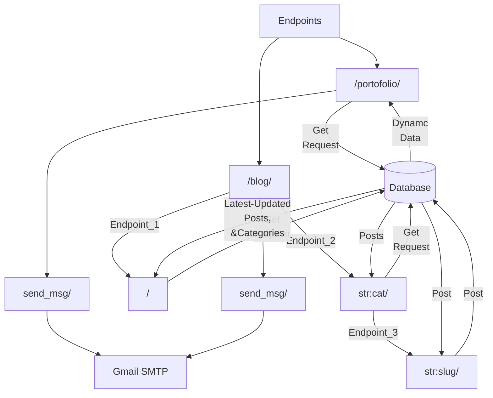

# xzanatol-website

## Overview

A personal project that is built to showcase my skillset, projects, Resume, and share my learning journey.

- Live [Portofolio](http://xzanatol-website.herokuapp.com/portofolio/).
- Live [Blog](http://xzanatol-website.herokuapp.com/blog/).

## Tech Stack Choices

### 1) Heroku
The platform was choosen as I wanted my site to be partially dynamic at the time where I can edit the frontend text directly from a database and not from editing a hard-codded text in the template files.

Comparing to pythonanywhere platform, Heroku provides working hours for the servers you host, while pythonanywhere can take your site down at random/specific times if you're using their free plan.

### 2) Django
I was first hesitant betwenn Django & Flask, but settled on Django as Heroku provides an online Postgres Database, but I didn't know much about SQL at the time so I went ahead and choosed Django as it's a battery framework and contains a built-in ORM which I can use to directly communicate with the database.

### 3) Bootstrap 5
I wanted a simple responsive frontend as my career journey isn't yet experienced enough. So the app won't have many positions-experience fields listed.

### 4) HTML / CSS
For other frontend Elements.

### 5) Git
For version control tracking.

### 6) External Python Modules
* whitenoise
> For delevering static files in production environment.

* gunicorn, psycopg2-binary
> For server deployment on Heroku.

* django-heroku
> For auto-prepare Heroku database configurations.

## Flowchart Diagram

> This diagram stimulates different app interactions from the user prespective.

## Future Implementations

> These ideas will be in progress after finishing GirlScript Summer of Code OpenSource contest **GSSoC'22**.

* Implementing Frontend with ReactJS.
* Adding more dynamic parts.
* Start uploading my learning blogs.
* Combine Python PDM for easier an easier development environment.

## Downsides

> I'm still learning about how to counter these weak points.

* Spamming might occur through feedback forms. (I've implemented CSRF token authetication to prevent direct POST requests using Curl, Postman, ..etc.)
* BruteForce on the admin panel might take place if the admin URL is found.

## How I learned this stack

1) Heroku

I mostly spent the time reading documentations to know how to:
	* Configure web dynos.
	* Installing Heroku CLI.
	* Interacting with the CLI to run bash instance and configure Heroku database.

2) Django

I had to sources which are:
	* thenewboston Youtube channel.
	* Book: Django 3 By Example.

3) Bootstrap 5

I used to learn Bootstrap 3 from ElZero Youtube channel, then continued sharpening my skill set from the documentation.

4) HTML / CSS - Git

from continous reading and experiminting.